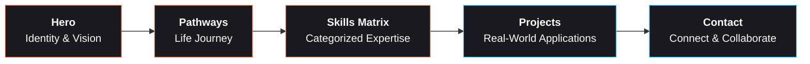

<div align="center">
  <br/>
  <pre style="font-family: 'JetBrains Mono', monospace; background: #0a0a0f; padding: 1.5rem; border-radius: 12px; border: 1px solid rgba(201, 100, 66, 0.2); color: #faf9f5;">
╔══════════════════════════════════════════════════╗
║                                                  ║
║                fabricioat_33                     ║
║             ────────────────                     ║
║       Forward Deployed Engineer & Web Dev        ║
║                                                  ║
╚══════════════════════════════════════════════════╝</pre>
  <br/>
  <h3 align="center" style="font-family: 'JetBrains Mono', monospace; color: #d97757;">
    <code>~ $ donde la agricultura se encuentra con la automatización · donde los drones se encuentran con el código ~</code>
  </h3>
  <br/>
</div>

<p align="center">
  
  
  
  
  
  
  
  
</p>

<br/>

---

## ⚡ Overview

**fabricioat_33** is the digital port of call for **Fabricio Aguirre T.** — a *Forward Deployed Engineer* whose trajectory spans from agricultural engineering and drone aviation to full-stack software development and LLM agent architectures.

> Every skill learned becomes a new neural pathway.  
> Every experience, a node in an ever-expanding network.

This portfolio isn't just a list of projects — it's a **living neural interface** that maps the convergence of agriculture, aviation, sales, sports coaching, and AI engineering into a single cohesive narrative.

<br/>

---

## 🧠 Neural Architecture



<br/>

---

## ✦ Sections

| # | Section | Description |
|:-:|---------|-------------|
| 01 | **Hero** | Cyberpunk-styled intro with animated particle field background |
| 02 | **Neural Pathways** | Timeline of life phases — from field to code |
| 03 | **Skills Matrix** | 7 domains, 13+ skills with categorized expertise |
| 04 | **Projects** | Real-world applications solving real problems |
| 05 | **Contact** | Direct links: email, GitHub, LinkedIn, WhatsApp |

<br/>

---

## 🛠️ Tech Stack

| Layer | Technology |
|-------|-----------|
| **Framework** | React 18 + TypeScript |
| **Build Tool** | Vite 5 |
| **3D Engine** | Three.js (particle field background) |
| **Animation** | GSAP + ScrollTrigger + Lenis |
| **Routing** | TanStack Router |
| **UI System** | MUI + Emotion + Custom Cyber Design System |
| **Deployment** | Cloudflare Workers |
| **Typography** | Space Grotesk + JetBrains Mono |
| **Smooth Scroll** | Lenis |

<br/>

---

## 🎨 Design DNA

```
Palette      →  Copper (#c96442 → #d97757 → #e6997a)
                Cyan   (#4fc3f7)
                Surface (#0a0a0f → #111118 → #1a1920)

Typography   →  Space Grotesk (display)
                JetBrains Mono (code/labels)

Atmosphere   →  Dark · Neural · Cyberpunk · Glassmorphism
                Noise overlay · Animated borders · Glitch effects
```

<br/>

---

## 🚀 Live

> **Production:** [jfabricioat2026portafolio.fabriaguirre.workers.dev](https://jfabricioat2026portafolio.fabriaguirre.workers.dev/)

The portfolio is deployed via **Cloudflare Workers** with global edge distribution. The `dist/` folder is built locally and deployed manually through the Cloudflare dashboard.

<br/>

---

## 🧪 Local Development

```bash
# Clone
git clone https://github.com/fabriaguirre1979/JFAT2026.git
cd JFAT2026

# Install
npm install

# Dev server
npm run dev

# Production build
npm run build

# Preview build
npm run preview
```

<br/>

---

## 🗺️ Roadmap

- [x] Initial deploy — Cloudflare Workers
- [x] Responsive navigation (mobile hamburger menu)
- [x] Language switch ES/EN
- [ ] Custom domain: `fabricioat2027.is-a.dev` ⏳
- [ ] WhatsApp direct chat on first touch (fixed)
- [ ] Project detail pages / modals
- [ ] Dark/light theme toggle
- [ ] Blog / writing section

<br/>

---

<div align="center">
  <sub style="font-family: 'JetBrains Mono', monospace; color: #807e75;">
    Built with 
    <span style="color: #c96442;">✦</span> 
    by 
    <a href="https://github.com/fabriaguirre1979" style="color: #d97757; text-decoration: none;">
      @fabriaguirre1979
    </a>
    <span style="color: #c96442;">✦</span>
    <br/>
    <span style="font-size: 0.8em;">
      Forward Deployed Engineer · Ecuador
    </span>
    <br/><br/>
    
    
  </sub>
</div>
